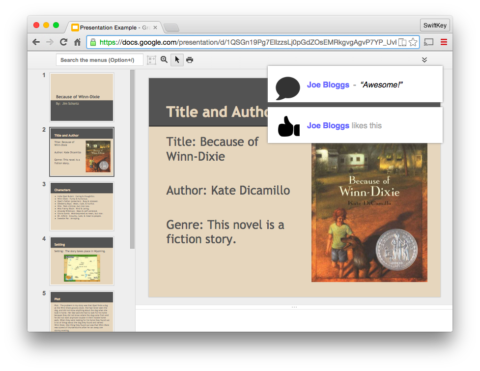
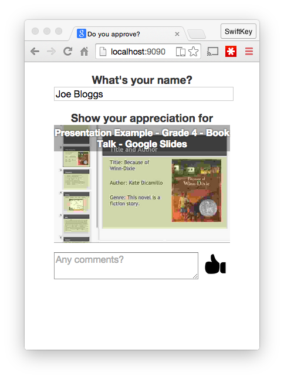

# iApprove

***

THIS REPOSITORY IS DEPRECATED. Please use: https://github.com/chetbox/iApprove

***

A "Like" button for your presentation running in Chrome/Chromium. You can also add comments!

Built on Chrome/Clojure/MongoDB.

## Features

- A web-based "Like" button that can be used by anyone on the same network
- Participants may add a comment if they wish
- The "Like" or comment is shown as a visual notification in the top right of your screen
- A live screenshot of the current browser tab for all participants
- All data saved to MongoDB (current URL, name of sender, comment if supplied)

## Requirements

- Leiningen 2
- MongoDB
- Chromium or Google Chrome

## Setup

1. Ensure you have a local MongoDB server running.

2. Start the server (it uses port 9090 by default).

        iApprove      $ cd clj
        iApprove/clj  $ lein run

3. Install the browser extension.

- Go to `Extensions`
- Enable `Developer mode`
- Click `Load unpacked extension...`
- Select the `chrome-extension` folder from the repo

## How to use

1. Find your IP address. (You can use `ifconfig` or `ipconfig` on Windows.)
2. Send the link with your IP address, using port 9090, to all participants. (They must be connected to the same network!)

- It should look something like this: `http://10.0.2.45:9090`

Participants should follow the link and enter their name in the field provided. When they press "Like" a notification will appear in your current browser tab.

When finished, *don't forget to disable the iApprove browser extension*.

## Saved data

All "likes" and "comments" are stored in the `i-approve` MongoDB database in the `comments` collection.
(A "like" is a "comment" that has no message.)

# License

Licensed under the [MIT License](LICENSE.txt). Copyright (c) 2015 TouchType Ltd.
